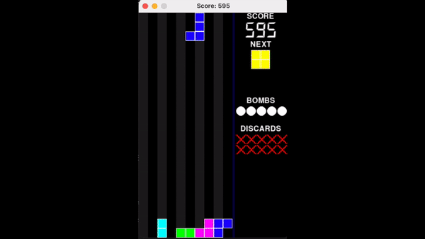

# AI Tetris player 

## 1. Sample result



## 2. Run the player

You should be able to use any recent version of Python 3. The auto-grader is currently running python 3.7.9, but you should be able to run more recent versions, so long as you don’t use any very new language features.

Note: If you’ve installed python as python3 on your computer, substitute python3 for python and pip3 for pip in all the instructions below.

Once you are in the code directory, you should be able to start the interface by running:

```shell
python visual.py 
```

To get a feeling for the game, you can also run any of the interfaces in manual mode by adding the flag -m:

```shell
python visual.py -m 
```

If that interface does not work, there are two alternative interfaces available:

+  A command-line interface; run python cmdline.py to use it. If you are using Windows, you may need to install the windows-curses package first; try running:

```shell 
pip --user install windows-curses.
```

+ A Pygame-based interface; run python visual-pygame.py to use it. For this, you need to have a working copy of Pygame; run

```shell
pip --user install pygame
```

to install it and run:

```shell
python visual-pygame.py
```

to run it with faster decision.

The pygame version is recommended as it works fastest when autoplaying. If you get an interface running, you should see the default player in action. This player is not very clever: it chooses random actions in hopes of eliminating a line. It is your job to write a better AI.

## 3. Our Tetris Variant

In the regular version of Tetris blocks of four squares known as Tetronimos drop, and you must guide them to a good landing place. When one or more lines is completed all the blocks in those lines are eliminated, the blocks above drop, and you score extra points. The goal is to score as many points as possible before the blocks reach the top of the screen. Normally the game gets faster as it progresses, so gets harder.

Our version has a number of differences from normal Tetris:

• If you play it manually, it doesn’t get faster. This is because, within limits, we don’t want the amount of time you take to calculate a move to matter.

• You only have 400 tetronimos to land. This changes the gameplay significantly. Just staying alive to the end is not going to result in a really high score.

• The scoring is weighted heavily in favour of eliminating more rows at a time. The scores for eliminating 1-4 rows are 25, 100, 400, 1600, so there’s a big benefit from not eliminating one row at a time.

• You can discard a tetronimo you don’t like. You only get to do this 10 times though. This makes play easier for a human, but it’s not necessarily easy for an AI to decide to do this.

• You can substitute a bomb in place of the next tetronimo! When a bomb lands it destroys all the immediately surrounding blocks, and all the blocks above it or the neighbouring squares will fall to the ground. Blocks destroyed by bombs don’t score anything. You only get five bombs, so use them wisely. Bombs also make play easier for a human, but add a new element for an AI.

## 4. Keybindings

In manual play, the key bindings are:

↑ - rotate clockwise → - move right

← - move left ↓ - move down

Space - drop the block

z - rotate anticlockwise

x - rotate clockwise

b - switch next piece for bomb d - discard current piece

Esc - exit game

If you don’t like the key bindings, feel free to change them. They’re in key to move in visual-pygame.py, UserPlayer.key() in visual.py, or UserPlayer.choose action() in cmdline.py.

## 5. Training

The training is performed by a randomly initialized set of parameters, which are then randomly perturbed based on a set of weights. Due to time constraints, gradient descent or other machine learning optimization algorithms were not used. Instead, the parameters with the highest scores were recorded and manually selected.

The decision algorithm used is **Pierre Dellacherie**, with parameters landing position, eroded piece cells (the number of rows eliminated × the number of the squares the piece contributed), board row transitions, board column transitions, board buried holes, and board wells.

### Parameters

- landing position: The position where the piece is dropped.
- eroded piece cells: The number of rows eliminated × the number of the squares the piece contributed.
- board row transitions: The number of rows that have changed their state.
- board column transitions: The number of columns that have changed their state.
- board buried holes: The number of holes that are buried by the piece.
- board wells: The number of wells that are created by the piece.

### Scoring

The algorithm tries all possible landing positions on the virtual board, calculates their scores separately, and then selects the best landing position to apply to the real board.

## 6. Reference

All the design is based on the Tetris on UCL ENGF002 (Assignment 4, T1/2022) by Prof. Mark Handley